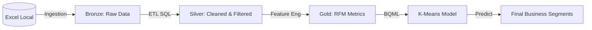

# Cloud-Native Customer Segmentation: BigQuery ML Pipeline

This project demonstrates the migration of a local Python-based K-means clustering pipeline to a production-scalable architecture using **Google Cloud BigQuery** and **BigQuery ML**.

## Architecture: The Medallion Pattern

We implemented a **Medallion Architecture** to ensure data quality and lineage throughout the ML lifecycle.



### 1. Ingestion Layer (Bronze)
- **Tool**: `src/bq_ingestion.py`
- **Action**: Automated upload of multi-sheet retail data from Excel to BigQuery staging tables.

### 2. Silver Layer (Cleaned)
- **Tool**: `src/sql/etl.sql`
- **Logics**: Standardized schema, removal of cancellations, and regex-based validation of `Invoice` and `StockCode` patterns, mirroring the original Python ETL logic.

### 3. Gold Layer (Curated Features)
- **Tool**: `src/sql/rfm.sql`
- **Features**: Aggregated Recency, Frequency, and Monetary (RFM) metrics. 
- **Transformations**: Applied Log-transformations directly in SQL to manage data skewness for optimal K-means performance.

### 4. Machine Learning Layer (BQML)
- **Tool**: `src/sql/model_training.sql`
- **Model**: K-Means clustering trained directly on the 2009-2010 dataset.
- **Automation**: Automatic feature standardization (Z-score) handled by the data warehouse.

## Orchestration & Deployment
The entire pipeline is orchestrated via **`src/bq_pipeline.py`**, which manages dependencies and executes the SQL transformation sequence.

```bash
# Run the end-to-end pipeline
python src/bq_pipeline.py
```

## Advanced Analytics & Visualizations
The final analysis is documented in [notebooks/bq_analysis.ipynb](file:///c:/Users/arq_c/Desktop/ds_projects/1_ml-pipeline-migration-bigquery/notebooks/bq_analysis.ipynb), featuring:

### 📈 Segment Drift Analysis
By training on 2009 data and scoring on 2011 data, we identify how the customer base migrates between segments (e.g., from *Champions* to *Hibernating*) over time.

### 🌌 PCA Cluster Separation
Applying Principal Component Analysis (PCA) to reduce 3D RFM features into 2D space, visually confirming the distinct separation of customer segments and ensuring model stability across periods.

## Tech Stack
- **Cloud**: Google Cloud Platform (GCP)
- **Data Warehouse**: BigQuery
- **Machine Learning**: BigQuery ML (K-Means)
- **Orchestration**: Python (Google Cloud SDK)
- **Analytics**: Scikit-Learn (PCA), Seaborn, Pandas
