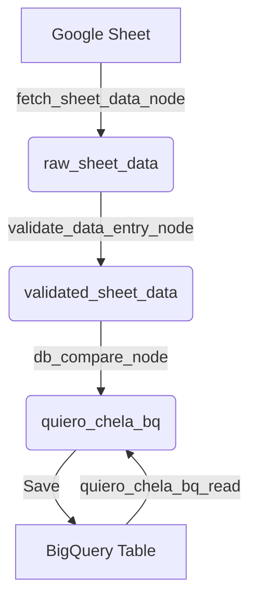

# cerveceria

[](https://kedro.org)

## Overview

Kedro project for extracting data from Google Sheets, validating it, performing a database discrepancy check, and pushing it to GCP BigQuery.

## Project Structure

```text
cerveceria/
├── conf/
│   ├── base/
│   │   ├── catalog.yml              # Dataset definitions (BigQuery & Memory)
│   │   ├── parameters.yml           # Base configurations
│   │   └── parameters_data_ingestion.yml
│   └── local/
│       └── credentials.yml          # Credentials (GCP, database access)
└── src/
    └── cerveceria/
        ├── pipeline_registry.py     # Map & register Kedro pipelines
        └── pipelines/
            ├── data_ingestion.py    # Node to ingest Google Sheets data
            ├── data_entry_validation.py # Chains validation & comparison nodes
            └── nodes.py             # Data clean, format, & DB comparison logic
```

## Pipeline Architecture

The project consists of three main steps:
1. **Ingest**: Fetches data from Google Sheets and saves it to a memory dataset.
2. **Validate**: Formats data, enforces types, and runs email validation.
3. **Compare & Save**: Merges the newest extract with the existing BigQuery table on the `id` column to detect and log inserts, updates, and deletions, and saves the final dataframe.



## How to run your Kedro pipeline

You can run your Kedro project with:

```bash
kedro run
```

## How to launch Kedro Viz

To view an interactive visualization of the pipeline structure, run the following command in your terminal:

```bash
kedro viz run
```

## How to test your Kedro project

You can run your pipeline tests using:

```bash
pytest
```
